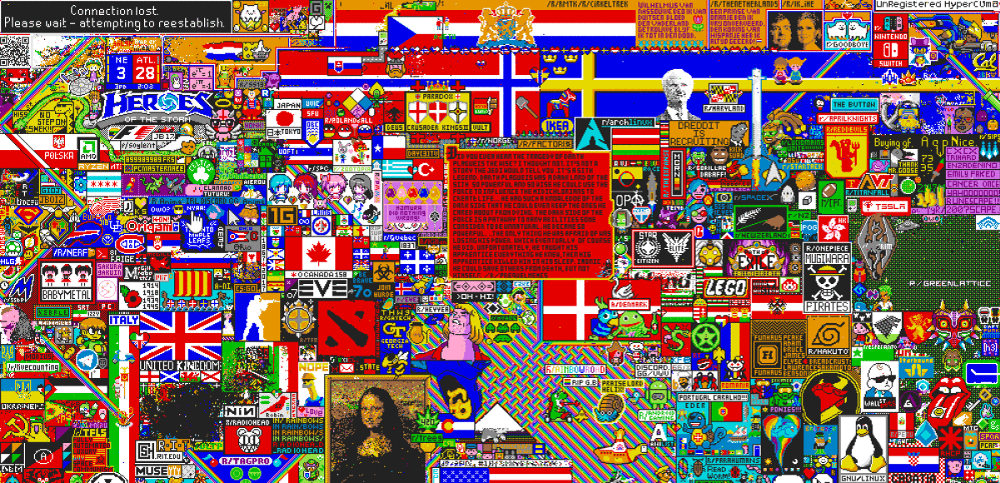

# Pixel Demo

This demo is roughly based on [Reddit's
r/Place](https://en.wikipedia.org/wiki/Place_(Reddit)), but has a 
number of additional features that showcase the unique affordances of
the Agoric platform, including: higher-order contracts, easy creation
of new assets, and safe code reusability.

|  | 
|:--:| 
| *Reddit's r/place as a social experiment in cooperation* |


## Installation

|  | 
|:--:| 
| *The testnet pixel demo. Slightly fewer pixels.* |


The pixel demo runs on [our private testnet](https://github.com/Agoric/cosmic-swingset#agorics-cosmic-swingset). For instructions on how to
run a local, off-chain version for yourself, please see [Scenario 3
here](https://github.com/Agoric/cosmic-swingset#different-scenarios).

## Getting Started

In the pixel demo, the goal is to be able to amass enough pixels to
draw a design on a pixel canvas. You start out empty-handed, with no
money and no pixels to your name. However, you do have access to the *gallery*, the
administrator of the canvas. The gallery has a handful of
methods that allow you to obtain a few pixels for free, color them,
sell them, and buy more.

To access the gallery, type `home.gallery` in the REPL. `home.gallery`
is a remote object (what we call a *presence*). It actually lives in
another environment (what we call a *vat*). Instead of obj.foo(), we
can write E(obj).foo() or the syntactic sugar, obj~.foo() and get a
promise for the result. We call this syntactic sugar ['wavy dot'](https://github.com/Agoric/proposal-wavy-dot). The syntax
means "deliver the message foo() to the actual object asynchronously,
in its own turn, wherever and whenever it is, even if it is local."
Using E or ~., you can talk asynchronously to local and remote objects
in exactly the same way. For example, the first thing you might want
to do is tap the gallery faucet to get a pixel for free:

```js
px = home.gallery~.tapFaucet()
```

`tapFaucet` returns a pixel and saves it under `px`. The pixel that you receive is
actually in the form of an ERTP payment. [ERTP](https://github.com/Agoric/ERTP) (Electronic Rights Transfer Protocol)]
is our smart contract framework for handling transferable objects.
Payments have a few functions. Let's call `getBalance()` on our payment
to see which pixel we received. 

```js
px~.getBalance()
```

You might see something like: 

```js
{"label":{"issuer":[Presence 15],"description":"pixels"},"quantity":[{"x":1,"y":4}]}
```

The `quantity` tells us which pixels we've received. `{ x:1, y:4 }`
means that we got a pixel that is in the fifth row (`y:4`) and 2 pixels
from the left (`x:1`). To color the pixel, we need to get the use
object from the payment. You can think of the use object as a regular
JavaScript object that just happens to be associated with an ERTP
payment. 

```js
use = px~.getUse()
```

Your use object will be stored under `use`. Now we
can use it to color. 

```js
use~.changeColorAll('#FF69B4')
```

The following commands show a pixel being obtained from the faucet,
getting the 'use' object, coloring the pixel, and selling a pixel to the gallery through an
escrow smart contract.  

```
px = home.gallery~.tapFaucet();
px~.getBalance();
use = px~.getUse();
use~.changeColorAll('yellow');
px2 = home.gallery~.tapFaucet();
asset2 = px2~.getBalance();
asset2.then(a => home.gallery~.pricePixelAssetDesc(a));
hostInvite = home.gallery~.sellToGallery(asset2);
seat = hostInvite~.host~.redeem(hostInvite~.inviteP);
offered = seat~.offer(px2);
assays = home.gallery~.getAssays();
pxPurse = assays~.pixelAssay~.makeEmptyPurse();
dustPurse = assays~.dustAssay~.makeEmptyPurse();
collected = offered.then(_ => home.gallery~.collectFromGallery(seat, dustPurse, pxPurse, 'my escrow'));
collected.then(_ => dustPurse~.getBalance());
```

Woohoo! We're now a few dust richer than when we started.

Learn more about ERTP and our pixel demo [here](https://github.com/Agoric/ERTP). 

To see the contracts you've uploaded [as per the README](lib/ag-solo/contracts/README-contract.md), try:

```js
home.uploads~.list()
home.uploads~.get('encouragementBot')~.spawn()~.encourageMe('Person')
```

### Initial Endowments

When a client is started up, it has a few items in a record named home.

* gallery: the Pixel Gallery, described above
* purse: a purse that can hold pixel Dust
* moolah: a purse that starts out with 1000 `moolah`
* sharingService: a service that makes it possible to pass capabilities between vats
* canvasStatePublisher: a service with the message subscribe(callback)
* [uploads](./lib/ag-solo/contracts/README-contract.md): a private directory
 of contracts you've uploaded
* registrar: a public directory for published objects
* localTimerService and chainTimerService: tools for scheduling
* [zoe](https://github.com/Agoric/ERTP/core/zoe/docs/zoe.md): support for contracts with Offer-Safety Enforcement
* [contractHost](https://github.com/Agoric/Documentation): secure smart contracts

#### sharingService

home.sharingService is a service that lets you connect to
other vats that are connected to the same remote chain vat. sharingService
has three methods: createSharedMap(name), grabSharedMap(name), and
validate(sharedMap). These allow you to create a SharedMap which you can
use to pass items to and from another vat. The sharingService's
methods are designed to allow you to share a newly created sharedMap
with one other vat, after which the name can't be reused.

The way to use it is to call createSharedMap() with a name that you share
with someone else. They then call grabSharedMap() and pass the name you
gave. If they get a valid SharedMap, then you have a private
channel. If they don't get it, then someone else must have tried to
grab the name first, and you can discard that one and try again.

Once you each have an end, either of you can call addEntry(key, value)
to store an object, which the other party can retrieve with
lookup(key).

#### canvasStatePublisher

home.canvasStatePublisher has a subscribe() method, which takes a callback
function. When the state of the pixel gallery changes, the callback's
notify() method is called with the new state.

