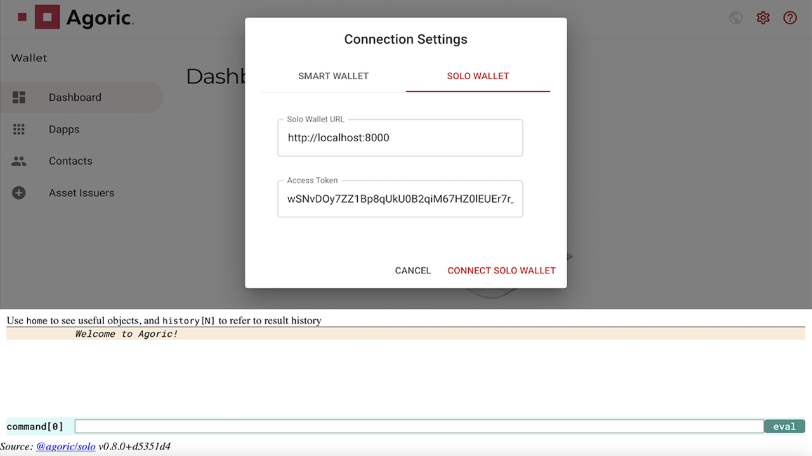
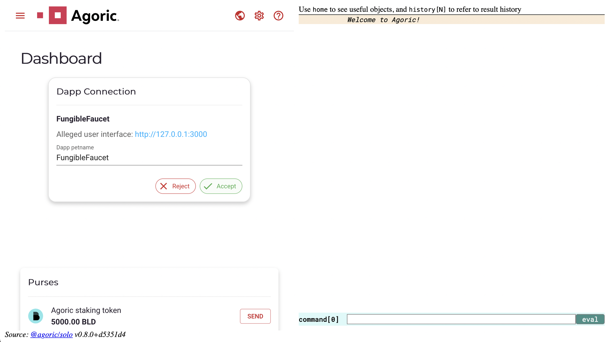
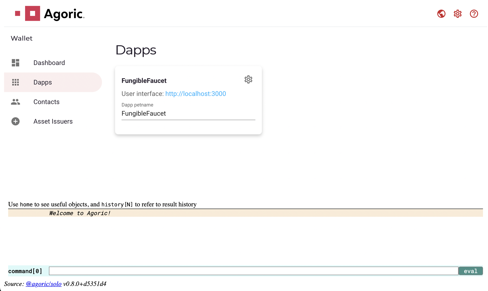
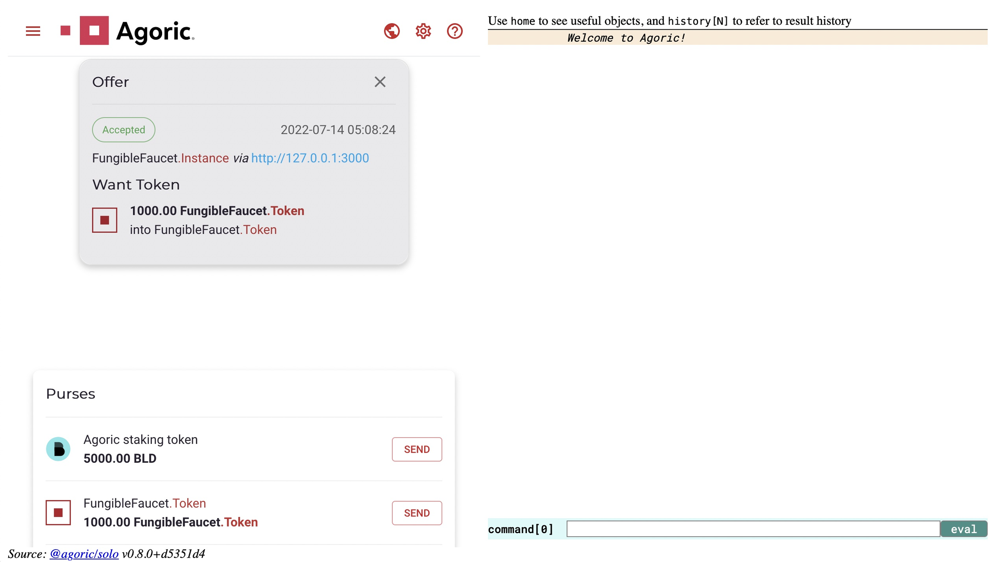

# Starting a Project

Before we begin, you should use `agoric --version` to double-check that you have [installed the Agoric SDK](./README.md).

If it is available, then you successfully installed the Agoric SDK. If not, then please do so before continuing. 

After you've [installed the Agoric SDK](./README.md), then you're ready for your first _Agoric Dapp_ (decentralized application) by continuing the instructions below. 

We'll be running **three terminal windows**. See below: 

 1. ```sh
    # Terminal 1: simulated blockchain and "solo" client
    ```
 2. ```sh secondary style2
    # Terminal 2: contract interaction
    ```
 3. ```sh secondary style3
    # Terminal 3: web user interface
    ```

::: tip Watch: Prepare Your Agoric Environment (November 2020)
This presentation includes starting a project, but note an outdated detail:

 - In the REPL `x~.go()` tildot support has been postponed; use `E(x).go()` instead.

<iframe width="560" height="315" src="https://www.youtube.com/embed/w0By22jYhJA" title="YouTube video player" frameborder="0" allow="accelerometer; autoplay; clipboard-write; encrypted-media; gyroscope; picture-in-picture" allowfullscreen></iframe>
:::

## Initialize the Default Dapp Template

The following section will explain how to initialize the default dapp template, install the Agoric SDK
into the dapp template, and then launch the Agoric Solo Client and Simulated Blockchain.

Use the [Agoric CLI](../agoric-cli/) to fetch from a dapp template
and put it in a directory _not located in your `agoric-sdk` clone_. We named the directory "demo", but you can name the folder whatever you like.

```sh
# Terminal 1
# Don't use your agoric-sdk as the parent of the demo directory.
cd $HOME
agoric init demo # use `agoric init $DIRNAME` with any name you like
cd demo
agoric install # will take a minute to install all dependencies
agoric start --verbose # `agoric start --reset` to start over
```

Learn more about the [available dapp templates](../dapps/dapp-templates.md). Our default dapp template is the [Fungible Faucet Dapp](https://github.com/Agoric/dapp-fungible-faucet).

::: tip Mac Dev Tools
On a Mac, you must first install
[Xcode](https://apps.apple.com/us/app/xcode/id497799835)
:::

Leave this process and its logs running in its own terminal window.

## Open the Agoric Wallet and REPL

```sh secondary style2
# Terminal 2
cd demo
agoric open --repl
```

This should automatically open [http://127.0.0.1:8000](http://127.0.0.1:8000) in a new browser window or tab.

To begin using the wallet, click the "Connect Solo Wallet" button.



After your solo wallet is connected, then you're ready to deploy the contract and API. 

## Deploy the Contract and API

In our second terminal, deploy the contract to the simulated blockchain
and the API to the solo client.

```sh secondary style2
# Terminal 2
cd demo # if not already there
agoric deploy ./contract/deploy.js 
agoric deploy ./api/deploy.js
```

We'll cover [deploying smart contracts](./deploying.md)
in detail later.

## Start the Dapp User Interface

The web user interface communicates with the API in the solo client as well as the wallet.

```sh secondary style3
# Terminal 3
cd demo # if not already there
cd ui && yarn start
```

Leave this running in its own terminal window and visit [http://localhost:3000](http://localhost:3000) in a web browser.

Once here, you will be asked to enable the dapp in your Agoric wallet.


## Connect the Dapp to the Agoric Wallet

Navigate back to [http://127.0.0.1:8000](http://127.0.0.1:8000) and accept the Dapp's request to connect to your wallet.



Navigating to the "Dapps" section of the Agoric Wallet should now show that you have successfully connected.



## Use the Dapp to collect your (simulated) tokens

Once your wallet has been connected, return to [http://localhost:3000](http://localhost:3000) and click the "Mint Fungible Tokens" button.


Navigate back to [http://127.0.0.1:8000](http://127.0.0.1:8000) to approve the offer and collect the tokens.


Your wallet's FungibleFaucet purse will now hold 1000 FungibleFaucet tokens.



Visit the [wallet UI](../wallet/ui.md#wallet-ui) documentation for more information.