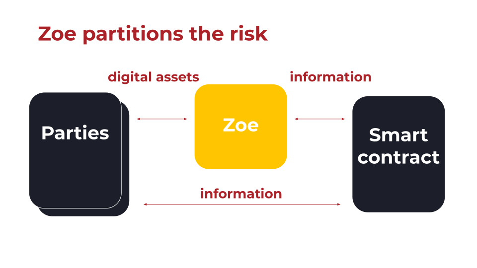

# Eventual Send with E()

In web browsers, a common pattern of remote communication is using the
[asynchronous fetch API with promises](
https://developer.mozilla.org/en-US/docs/Learn/JavaScript/Asynchronous/Introducing#promises):

<<< @/snippets/test-distributed-programming.js#asyncFetch

In the Agoric platform, communicating with remote objects is similar,
using the `E()` wrapper. For example,
a [deploy script](../getting-started/deploying.md) may want to use the
[Zoe Service API](/reference/zoe-api/zoe.md) to install a contract on a blockchain.
But the deploy script cannot call `zoe.install(bundle)`, because it does not have local
access to the `zoe` object. However, the deploy
script is given a `zoe` *remote presence*. To call methods on the
actual Zoe object, the deploy script can do:

```js
import { E } from '@endo/eventual-send';

E(zoe).install(bundle)
  .then(installationHandle => { ... })
  .catch(err => { ... });
```

Since any call to `E(target).method(...args)` may be remote, Endo automatically hardens the `args`. So in the above example, we did not need to call `harden(bundle)` since Eventual Send handles this for us.

## Eventual Send

One of the ways [Zoe partitions risk](https://www.youtube.com/watch?v=T6h6TMuVHKQ&t=368s) is by running in its own [vat](../../glossary/README.md#vat), separate from any smart contract that might
use too much compute time or heap space. The smart contracts also run in separate vats.



What happens when we call `E(zoe).install(bundle)` is an _eventual send_:

 1. A message consisting of the method name `install`
    with the `bundle` argument [marshaled](./far.md)
    to a flat string and queued for delivery to
    the vat that `zoe` comes from.
 2. `E(zoe).install(bundle)` returns a promise for the result.
 3. The `then` and `catch` methods queue callbacks for when the promise
    is resolved or rejected.
    Execution continues until the stack is empty and thus this
    turn through the event loop completes.
 4. _Eventually_ `zoe` responds, which results in a new message
    in this vat's message queue and a new turn through the event loop.
    The message is de-serialized and the results are passed to the relevant callback.

This way, you can communicate with objects in separate vats
as easily as objects in the same vat with one wrinkle: the communication
must be _asynchronous_.

The `E()` wrapper works with:

  - Remote presences (local proxies for objects in remote vats).
  - Local objects (in the same vat).
  - Promises for remote presences or local objects.

In all cases, `E(x).method(...args)` returns a promise.

::: tip Promise Pipelining
Since `E()` accepts promises, we can compose eventual sends:
`E(E(object1).method1(...args1)).method2(...args2)`. This way
we can take advantage of _promise pipelining_ so that a single
round trip suffices for both method calls.
:::

::: tip Troubleshooting remote calls
The `E()` function creates a
forwarder that doesn't know what methods the remote object has.
If you misspell or incorrectly capitalize the method name,
the local environment can't tell you've done so. You'll only find out at runtime when the 
remote object complains that it doesn't know that method.

If an ordinary synchronous call (`obj.method()`) fails because the method doesn't exist, the `obj` may be remote, in which case `E(obj).method()` might work.
:::

::: tip Watch: How Agoric Solves Reentrancy Hazards (November 2020)
for more on eventual send and remote communication
<iframe width="560" height="315" src="https://www.youtube.com/embed/38oTyVv_D9I" title="YouTube video player" frameborder="0" allow="accelerometer; autoplay; clipboard-write; encrypted-media; gyroscope; picture-in-picture" allowfullscreen></iframe>
:::
